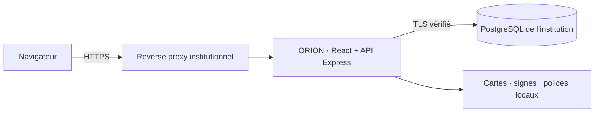

# ORION — Aide à la conduite PCi Genève

ORION est une application web en français pour les aides à la conduite de la protection civile : centraliser les renseignements, tenir une carte de situation, suivre les moyens, documenter les décisions et préparer les rapports. L’interface reprend le design ORION fourni, avec un poste de travail sombre et des vues métier cohérentes.

**Version 0.2.1 — démonstration fonctionnelle et préparation d’un pilote institutionnel.** Projet indépendant, sans affiliation, homologation ou approbation de l’État de Genève ou de l’OFPP. Les scénarios livrés sont fictifs.

Le logiciel peut être exploité dans l’infrastructure de l’institution, avec **son propre serveur PostgreSQL**. Aucun abonnement cloud, service d’IA ou service cartographique externe n’est requis à l’exécution. Le code est sous **AGPL-3.0-only** ; la visibilité privée de ce dépôt ne change pas sa licence.

## Sommaire

- [Démarrage rapide](#démarrage-rapide)
- [Fonctionnalités](#fonctionnalités)
- [Parcours de démonstration](#parcours-de-démonstration)
- [Cartes swisstopo et signes OFPP](#cartes-swisstopo-et-signes-ofpp)
- [Architecture](#architecture)
- [Rôles et accès](#rôles-et-accès)
- [Sécurité](#sécurité)
- [Configuration](#configuration)
- [Installation institutionnelle](#installation-institutionnelle)
- [Import et export](#import-et-export)
- [Développement et tests](#développement-et-tests)
- [Structure du dépôt](#structure-du-dépôt)
- [Limites et préparation commerciale](#limites-et-préparation-commerciale)
- [Licence et contributions](#licence-et-contributions)
- [Documentation](#documentation)

## Démarrage rapide

### Prérequis

- Accès au dépôt GitHub privé et Git installé.
- **Node.js 24 recommandé**, minimum 22.18, avec npm.
- Aucun serveur PostgreSQL ni Docker nécessaire pour la démonstration.
- Python 3 et `curl` seulement pour régénérer les ressources officielles ; OpenSSL pour le test PostgreSQL natif.

```sh
git clone https://github.com/ludovic111/ORION.git
cd ORION
npm ci
npm run build
npm start
```

Ouvrir **[http://127.0.0.1:4311](http://127.0.0.1:4311)** et choisir **Ouvrir la démonstration**. Ce mode ne demande pas de mot de passe ; il est réservé à la boucle locale et interdit en production. Utiliser cette adresse exacte : l’API vérifie l’origine des requêtes.

Le scénario « EX ORION-26 · Crue de l’Arve » est créé automatiquement dans la base locale à la première initialisation. Les modifications persistent dans `.data/orion` grâce à PostgreSQL embarqué PGlite. La clé de développement est créée dans `.data/app.key`. Ces fichiers ne sont pas versionnés et ne doivent pas être partagés.

Arrêter le serveur avec `Ctrl+C`. Relancer `npm start` pour retrouver les données. Il n’existe aucune commande de remise à zéro automatique : préserver les données utiles avant toute suppression manuelle.

## Démonstration partageable et cadre institutionnel

Pour un accès indépendant du Mac, utiliser le [service de démonstration hébergé](docs/HOSTED-DEMO.md) : stockage persistant, invitations de sept jours et origine HTTPS stable.

La version 0.2 ajoute des **invitations temporaires avec exercices isolés**, un **Cadre du dossier** validé avant les écritures réelles, des exports motivés et un audit de consultation. Les engagements réels exigent une activation explicite de l’exploitant (`REAL_OPERATIONS_ENABLED=true`) ; les démonstrations restent limitées aux exercices.

Les ordres disposent d’un formulaire **OIMDE OFPP**, d’un suivi des échéances et d’une heure d’observation distincte de l’enregistrement. La carte affiche les coordonnées suisses **MN95 approchées** ; les exemples de la collection OFPP sont séparés des signes plaçables.

- [Faire tester ORION dans Brave ou à distance](docs/DEMONSTRATION.md) : lancement, invitations, révocation et limites du tunnel temporaire.
- [Cadre de conformité Genève / Confédération](docs/COMPLIANCE.md) : références officielles, contrôles effectifs, migration 0.1 et décisions restant à l’institution.

## Fonctionnalités

| Vue                   | Fonctions disponibles                                                                                    |
| --------------------- | -------------------------------------------------------------------------------------------------------- |
| Situation générale    | Vue synthétique du dossier, indicateurs calculés, carte, journal et formations                           |
| Dossiers d’engagement | Création guidée, exercice ou réel selon le mode, affectations, clôture et réouverture                    |
| Journal               | Renseignements, priorités, sources, degré de confirmation, attribution, décisions, validation et filtres |
| Carte de conduite     | Quatre affichages swisstopo, calques, signes OFPP, coordonnées, mesure de distance et zones dessinées    |
| Moyens et partenaires | Effectifs, localisation, états modifiables par glisser-déposer ou liste accessible, matériel et stocks   |
| Analyse des liaisons  | Relations explicites entre objets et graphe interactif ; aucune inférence automatique de causalité       |
| Transmissions         | Registre radio/téléphone, destinataires, priorités et accusés de réception                               |
| Rapports              | Synthèse préremplie à relire, rédaction, validation humaine, impression PDF via le navigateur            |
| Cadre du dossier      | Finalité, base légale, responsable, destinataires, conservation, archives, AIPD, revue et validation     |
| Administration        | Comptes, rôles, affectations, suspension, import JSON, état de la base et vérification de l’audit        |

Les données sont réellement enregistrées côté serveur. Les partenaires sont des objets métier : leur création ne leur ouvre pas de compte. Le registre des transmissions ne réalise aucun envoi sur POLYCOM, par téléphone ou par e-mail.

## Parcours de démonstration

1. Ouvrir le dossier fictif « Crue de l’Arve ».
2. Ajouter une entrée journal avec sa source, sa priorité et son degré de confirmation.
3. Ouvrir la carte, choisir un fond et placer un signe officiel.
4. Changer l’état d’un moyen puis créer une liaison entre renseignement, ordre et moyen.
5. Consigner la transmission effectuée par l’opérateur sur son réseau habituel.
6. Préparer un rapport, relire la synthèse, le valider et l’imprimer.
7. Vérifier la trace des modifications dans **Administration → Journal d’audit**.
8. Créer un autre dossier pour constater que ses données sont séparées.

Un clone neuf contient le scénario de départ ; les objets `QA` issus des essais locaux du développeur ne sont pas publiés avec la base.

## Cartes swisstopo et signes OFPP

Le sélecteur **Fond de carte** propose :

- **Carte couleur** : carte nationale swisstopo.
- **Noir et blanc** : carte nationale en niveaux de gris.
- **Sombre** : traitement visuel du fond gris, sans altération des couleurs des signes.
- **Vue aérienne** : SWISSIMAGE.

Le dépôt inclut **1 830 tuiles locales** sur trois couches sources. Le périmètre couvre le canton de Genève, Céligny compris, et ses environs : latitude 46.10–46.40, longitude 5.90–6.35. Les niveaux natifs sont 11–14 ; les niveaux 15–16 agrandissent ces images, sans détail cartographique supplémentaire. Les coordonnées saisies et affichées sont en WGS84.

Les cartes sont servies par ORION : le navigateur ne transmet pas les positions opérationnelles à swisstopo. La préférence d’affichage est conservée dans le navigateur ; les données opérationnelles ne le sont pas. Le cache initial date du **18 septembre 2026** et ne constitue ni une carte de danger ni un flux temps réel.

La bibliothèque contient **268 signes issus de l’OFPP, édition française 2026**. Les SVG originaux sont conservés dans `public/symbols`, avec leurs empreintes SHA-256 et leur provenance. Les copies dans `public/symbols/display` ajustent seulement le cadrage de l’élément SVG racine pour retirer les marges ; le contenu graphique, les formes et les couleurs sont préservés.

```sh
npm run assets
node scripts/normalize-symbols.mjs
npm run build
```

La préparation contacte les sources officielles OFPP et swisstopo. Les tuiles déjà présentes sont conservées : une actualisation nécessite un lot neuf dans un environnement de préparation et une mise à jour explicite de la provenance. Voir le [guide du cache](docs/DEPLOYMENT.md#cache-cartographique), les [sources métier](docs/SOURCES.md) et les [conditions des ressources tierces](THIRD_PARTY_NOTICES.md).

## Architecture



- **Interface** : React 19, TypeScript, Vite, Leaflet et polices locales.
- **API** : Node.js, Express 5, validation Zod et requêtes SQL paramétrées.
- **Données** : PostgreSQL via `pg` ; PGlite pour la démonstration locale.
- **Isolation métier** : les utilisateurs sont affectés aux dossiers via `memberships` ; les fiches `records` appartiennent à un dossier.
- **Écritures** : transactions, verrouillage et version entière pour détecter les éditions concurrentes. Un conflit retourne HTTP 409.
- **Actualisation** : interrogation toutes les 15 secondes, sans WebSocket ni écriture hors ligne.

Le navigateur accède à l’interface et à l’API sur une même origine. Aucun SaaS, CDN, outil analytique ou fournisseur d’IA n’est requis à l’exécution. La connexion à la base est configurée côté serveur ; ses identifiants ne sont jamais fournis au navigateur.

## Rôles et accès

| Rôle            | Lecture           | Saisie courante | Ordres, validation, rapports | Création de dossier | Clôture | Administration |
| --------------- | ----------------- | --------------- | ---------------------------- | ------------------- | ------- | -------------- |
| Lecture         | Dossiers affectés | Non             | Non                          | Non                 | Non     | Non            |
| Opérateur       | Dossiers affectés | Oui             | Non                          | Non                 | Non     | Non            |
| Chef de cellule | Dossiers affectés | Oui             | Oui                          | Oui                 | Non     | Non            |
| Commandement    | Dossiers affectés | Oui             | Oui                          | Oui                 | Oui     | Non            |
| Administrateur  | Tous les dossiers | Oui             | Oui                          | Oui                 | Oui     | Oui            |

Les contrôles sont appliqués sur le serveur. Un grade ou le nom d’une formation ne confère aucun droit. Les changements d’habilitation et les suspensions révoquent les sessions existantes. Un dossier clôturé reste consultable, mais refuse les nouvelles écritures jusqu’à sa réouverture autorisée.

## Sécurité

Les protections implémentées comprennent :

- Mots de passe hachés par scrypt avec sel unique ; second facteur TOTP et protection contre le rejeu.
- Chiffrement AES-256-GCM des secrets MFA.
- Cookies HttpOnly, SameSite Strict et Secure en production ; jetons de session stockés sous forme d’empreinte.
- Expiration après 30 minutes d’inactivité ou 8 heures au maximum. Le rafraîchissement automatique ne prolonge pas la session.
- Contrôle d’origine, jetons CSRF, CSP, limitation de débit et verrouillage après échecs de connexion.
- Audit transactionnel en ajout seul, avec chaîne SHA-256 vérifiable.
- TLS PostgreSQL avec vérification du certificat et séparation des comptes de migration et de service.

Le chiffrement des disques et sauvegardes, la disponibilité et la sécurité du réseau relèvent de l’exploitation. La chaîne d’audit n’est pas un stockage WORM et ne protège pas contre un administrateur SQL disposant de privilèges suffisants. Consulter [SECURITY.md](SECURITY.md) avant un pilote institutionnel.

## Configuration

Sans fichier `.env`, `npm start` utilise la démonstration locale. Pour personnaliser le développement, copier `.env.example` vers `.env` et adapter les valeurs. Les scripts de démarrage chargent ce fichier s’il existe.

| Variable                                                  | Usage                                                                                                 |
| --------------------------------------------------------- | ----------------------------------------------------------------------------------------------------- |
| `NODE_ENV`                                                | `production` active les exigences institutionnelles ; absent en démonstration                         |
| `APP_MODE`                                                | `demo`, `preview` ou `institution` ; démonstrations interdites en production                          |
| `REAL_OPERATIONS_ENABLED`                                 | `false` par défaut ; `true` après recette institutionnelle pour autoriser les nouveaux dossiers réels |
| `HOST`                                                    | Adresse d’écoute, `127.0.0.1` par défaut ; loopback obligatoire en démonstration                      |
| `PORT`                                                    | Port HTTP, `4311` par défaut                                                                          |
| `APP_ORIGIN`                                              | Origine exacte du navigateur, HTTPS obligatoire en production                                         |
| `DATA_DIR`                                                | Chemin de la base PGlite, `.data/orion` par défaut                                                    |
| `DATABASE_URL`                                            | Connexion du compte PostgreSQL applicatif ; obligatoire en production                                 |
| `DATABASE_CA_FILE`                                        | Chemin de la CA pour vérifier le certificat PostgreSQL                                                |
| `APP_KEY`                                                 | Clé MFA de 32 octets aléatoires, encodée en 64 caractères hexadécimaux                                |
| `TRUSTED_PROXIES`                                         | Adresses ou réseaux des reverse proxies maîtrisés, séparés par des virgules                           |
| `MIGRATION_DATABASE_URL`                                  | Compte propriétaire utilisé exclusivement par le script de migration                                  |
| `BOOTSTRAP_EMAIL`, `BOOTSTRAP_NAME`, `BOOTSTRAP_PASSWORD` | Création du premier administrateur ; mot de passe de 14–128 caractères                                |
| `TEST_DATABASE_URL`                                       | Base PostgreSQL de test vide et jetable, jamais une base utilisateur                                  |

Injecter les secrets de production depuis le coffre institutionnel. Ne pas mettre de paramètre SSL dans `DATABASE_URL` : ORION configure explicitement TLS. La perte ou une rotation non préparée de `APP_KEY` empêche de déchiffrer les secrets MFA.

## Installation institutionnelle

Le support « apportez votre base » correspond à **un serveur PostgreSQL 17+ avec une base ou un schéma dédié à ORION**. Il ne s’agit pas d’un connecteur automatique vers un schéma métier préexistant, Oracle ou SQL Server.

1. Préparer PostgreSQL, son certificat, la CA, un compte propriétaire pour les migrations et un compte applicatif distinct.
2. Configurer le mode institutionnel, l’origine HTTPS et les secrets.
3. Installer les dépendances avec `npm ci`, puis initialiser le schéma avec `npm run migrate` dans l’environnement de migration.
4. Appliquer les droits de [postgres-grants.sql](docs/postgres-grants.sql) avec le compte propriétaire, en adaptant les noms.
5. Exécuter `npm run bootstrap` avec les variables de création du premier administrateur. Le script refuse de créer un second administrateur.
6. Construire l’application et démarrer le service derrière le reverse proxy HTTPS.
7. Enrôler le TOTP, créer les comptes et dossiers, puis vérifier les habilitations, l’audit et les sauvegardes.

Un [Dockerfile](Dockerfile) et un [exemple Compose](compose.yaml) sont fournis. Compose utilise **votre PostgreSQL externe** ; il ne crée pas de base exposée. Le service s’exécute sans privilèges root, avec système de fichiers en lecture seule et port publié sur loopback. Aucune migration DDL n’est exécutée automatiquement au démarrage en production.

Suivre le [guide complet de déploiement](docs/DEPLOYMENT.md) pour les commandes, les proxies, les sauvegardes, la restauration et la gestion des clés.

## Import et export

**Administration → Sources de données** permet d’importer des moyens, stocks et objets cartographiques dans le dossier sélectionné. Le fichier suit le modèle [public/import-example.json](public/import-example.json).

- Format JSON, 200 objets au maximum et corps HTTP limité à 256 Ko.
- Validation serveur de chaque objet ; une ligne invalide annule tout le lot.
- Import en ajout : ce n’est pas une synchronisation ni une fusion automatique de données existantes.
- Les liaisons ne peuvent référencer que des objets du même dossier.

L’export JSON est réservé aux rôles de conduite, limité au dossier autorisé et enregistré dans l’audit. Les exports contiennent des données métier et doivent être protégés selon leur sensibilité. Ils ne remplacent pas une sauvegarde PostgreSQL complète des utilisateurs, sessions, habilitations et journaux.

## Développement et tests

| Commande                                  | Effet                                                                 |
| ----------------------------------------- | --------------------------------------------------------------------- |
| `npm ci`                                  | Installer les versions du lockfile                                    |
| `npm run build`                           | Générer l’archive du code source et compiler l’interface dans `dist`  |
| `npm start` / `npm run dev`               | Servir la dernière compilation et l’API ; pas de rechargement à chaud |
| `npm run check`                           | Vérifier TypeScript                                                   |
| `npm test`                                | Tests API, sécurité, persistance et ressources officielles            |
| `npm run test:postgres`                   | Tests API sur PostgreSQL natif temporaire, TLS et privilèges          |
| `npm run format` / `npm run format:check` | Appliquer / vérifier le formatage                                     |
| `npm run assets`                          | Préparer les ressources officielles et le cache borné                 |
| `npm run migrate` / `npm run bootstrap`   | Initialiser le schéma / le premier administrateur                     |

Après modification du frontend, relancer `npm run build`. Après modification du serveur, redémarrer le processus Node.

```sh
npm run format:check
npm run check
npm test
npm run test:postgres
npm run build
npm audit --omit=dev
```

Le test natif démarre son propre PostgreSQL sur loopback, génère un certificat d’essai avec OpenSSL, vérifie les droits puis arrête et supprime cette base temporaire. La suite peut aussi cibler `TEST_DATABASE_URL`, uniquement vers une base de test vide et jetable.

Le [rapport de validation](docs/VERIFICATION.md) distingue les essais effectués et les points restant à valider. La CI [ORION checks](.github/workflows/ci.yml) prévoit formatage, TypeScript, tests PGlite et PostgreSQL 17, compilation, audit des dépendances de production et construction Docker. Consulter les [exécutions GitHub Actions](https://github.com/ludovic111/ORION/actions) pour leur résultat effectif.

## Structure du dépôt

```text
src/                   Interface React, styles et composants
server/                API, authentification, validation, SQL et scénario fictif
public/fonts/          Polices locales
public/symbols/         SVG OFPP originaux, catalogue et copies d’affichage
public/tiles/           Fonds swisstopo locaux
scripts/               Migration, bootstrap, ressources et tests PostgreSQL
tests/                Tests automatisés
docs/                 Architecture, exploitation, sécurité métier et pilote
.github/workflows/     Vérifications CI
Dockerfile             Image de service
compose.yaml           Exemple d’exploitation avec PostgreSQL externe
```

`node_modules`, `dist`, `.data`, les secrets `.env`, les archives générées et les fichiers de référence locaux sont exclus du dépôt. L’export HTML de design fourni reste dans le dossier de travail initial ; il n’est pas nécessaire pour compiler ou utiliser ORION.

## Limites et préparation commerciale

Cette version permet de démontrer un parcours complet et de préparer un pilote supervisé. Elle n’a pas encore reçu d’audit de sécurité externe, de recette PCi genevoise, de preuve de montée en charge ou de validation de restauration institutionnelle.

Les fonctions suivantes ne sont pas implémentées :

- Connexion SSO/LDAP/SAML et récupération automatisée des comptes.
- Flux actifs SITG, MétéoSuisse, alertes ou réseau radio.
- Écriture hors ligne, haute disponibilité et réplication multi-site validées.
- Pagination de grands dossiers ; les objets sont actuellement chargés en mémoire.
- Archivage externe WORM et collecte SIEM déjà raccordés.

Le [dossier de pilote institutionnel](docs/PILOTE-INSTITUTIONNEL.md) décrit le scénario commercial, les prestations possibles, les critères de réception et les validations à obtenir : organisation métier, données, conservation, accessibilité, infrastructure et cadre d’acquisition. Aucune conformité LIPAD ou attribution de marché n’est présumée.

## Licence et contributions

Le code ORION est sous **[AGPL-3.0-only](LICENSE)**. L’application propose le téléchargement du code correspondant à sa compilation. L’archive est générée à partir d’une liste explicite qui exclut secrets et données opérationnelles.

La licence permet une offre commerciale d’installation, d’intégration, de formation, de maintenance et de support. Une vente ne retire pas rétroactivement les droits accordés sur les versions déjà distribuées. Le dépôt reste privé tant que son propriétaire ne décide pas d’une publication publique.

Les ressources officielles, polices et dépendances conservent leurs propres conditions. Les droits sur le design et la réutilisation commerciale des ressources OFPP doivent être confirmés avant diffusion commerciale publique. Voir [THIRD_PARTY_NOTICES.md](THIRD_PARTY_NOTICES.md).

Pour contribuer, créer une branche, limiter la modification au besoin visé, expliquer son effet métier et exécuter les vérifications concernées. Ne joindre aucune donnée opérationnelle, base locale ou secret à une issue ou pull request. Les signalements sensibles suivent [SECURITY.md](SECURITY.md).

## Documentation

| Document                                               | Contenu                                                         |
| ------------------------------------------------------ | --------------------------------------------------------------- |
| [Architecture](docs/ARCHITECTURE.md)                   | Modèle, frontières de confiance, authentification et audit      |
| [Déploiement](docs/DEPLOYMENT.md)                      | PostgreSQL, TLS, bootstrap, proxies, sauvegardes et maintenance |
| [Sécurité](SECURITY.md)                                | Protections, responsabilités et risques résiduels               |
| [Sources métier](docs/SOURCES.md)                      | Références genevoises, OFPP et swisstopo                        |
| [Pilote institutionnel](docs/PILOTE-INSTITUTIONNEL.md) | Présentation commerciale et étapes de réception                 |
| [Validation](docs/VERIFICATION.md)                     | Essais exécutés et limites de leur portée                       |
| [Ressources tierces](THIRD_PARTY_NOTICES.md)           | Provenance, attributions et conditions de réutilisation         |
