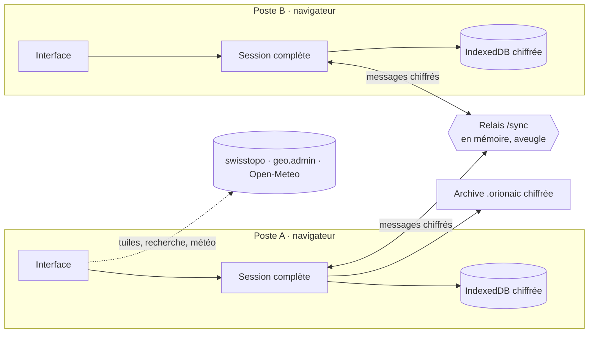

# Architecture d’orion aic

Version 2.0 : application React / TypeScript / Vite, sans base de données. Le serveur sert les fichiers statiques et un relais WebSocket qui ne stocke rien.



## Données

Une **session** (`Workspace`) contient un opérateur déclaré, un ou plusieurs **journaux**, le journal actif, les brouillons et, facultativement, le code de synchronisation. Tout est validé par Zod (`shared/journal.ts`, `shared/ops.ts`).

```
Workspace
├─ version, author, activeId, drafts, room (local), gone (journaux retirés)
└─ journals[]
   ├─ id, title, organization, location, reference, mode, classification, createdAt, closedAt
   ├─ entries[] → revisions[]      journal d’intervention (versions, jamais écrasées)
   ├─ deleted[]                    traces des entrées supprimées
   ├─ radio                        groupes, noms d’appel, terminaux et remises, contrôles
   ├─ ops                          données des modules
   │  ├─ messages                  réception et synthèse
   │  ├─ cells, members            postes / cellules et personnes
   │  ├─ resources                 moyens
   │  ├─ contacts                  annuaire
   │  ├─ places                    objets de la carte (point, ligne, zone, texte)
   │  ├─ agenda                    rythme de conduite
   │  ├─ facts, boards             renseignements clés, tableaux de situation
   │  ├─ observations, alerts      météo
   │  ├─ links                     liens explicites entre deux éléments
   │  └─ settings                  référentiels, lieu météo, vue de carte
   └─ sync { clock, removed }      horodatage des changements locaux, suppressions
```

Chaque élément des modules porte un identifiant, sa date de création, de modification et son auteur. Les anciens journaux (1.x) se chargent avec des modules vides.

## Liens

`shared/links.ts` expose chaque élément sous la forme `type:id` (`entry:…`, `message:…`, `place:…`, `resource:…`…), avec un titre, un sous-titre et une tonalité. Les liens combinent :

- les **liens explicites** (`ops.links`) créés par l’opérateur (« Lier ») ou par une action (« Inscrire au journal », « Placer sur la carte ») ;
- les **liens implicites** calculés : références `#012` entre entrées, message inscrit au journal, membre d’un poste, groupes d’un nom d’appel, terminal remis à un nom d’appel, et tout émetteur / destinataire / responsable / détenteur qui correspond au nom d’un poste, d’une personne, d’un moyen, d’un contact ou d’un nom d’appel.

Le graphe (`items`, `edges`) alimente les aperçus au survol, les fiches, la recherche ⌘K et le réseau des liens.

## Synchronisation sans base de données

1. Un poste crée un code de session (16 caractères). Le code n’est jamais envoyé : il sert à dériver l’identifiant de salle (SHA-256) et la clé AES-256-GCM (PBKDF2).
2. Chaque modification locale passe par `setWorkspace`, qui compare l’ancienne et la nouvelle version et horodate les éléments touchés (`stampJournal`). Les journaux modifiés partent 300 ms après la dernière frappe, compressés et chiffrés.
3. À la réception, `mergeJournal` combine les versions de façon déterministe et commutative : versions d’entrées réunies, suppression d’entrée prioritaire, dernière modification gagnante pour les autres éléments, suppression gagnante sur une modification plus ancienne, numéros en double attribués à l’entrée la plus ancienne, plan radio réparé si deux postes ont créé le même nom d’appel. Tous les postes convergent vers le même état.
4. À la connexion puis toutes les 40 s, chaque poste annonce l’empreinte de ses journaux ; un poste dont l’empreinte diffère renvoie ses journaux. Un poste resté hors ligne se remet ainsi à jour.
5. Le relais (`server/relay.mjs`, WebSocket RFC 6455 sans dépendance) ne connaît que des salles en mémoire et transmet des enveloppes opaques.

Le mode réseau local (`server/lan.mjs`) sert la même application et le même relais en HTTPS sur le réseau du poste de conduite, avec un certificat auto-signé.

## Interface

- `src/App.tsx` : coque (dock, barre supérieure, palette ⌘K, dialogues), état de session, synchronisation, impression automatique, routage par ancre (`#journal`, `#map`…).
- `src/app/` : contexte partagé (`useApp`), liste des modules, réglages du poste, dialogue Réglages.
- `src/modules/<module>/` : un dossier par module (situation, journal, messages, missions, carte, moyens, équipe, contacts, météo, agenda, réseau, aide).
- `src/ui/` : kit d’interface (champs standardisés, fiche générique, liens et aperçus, feuille latérale, effets, champ d’étoiles). Guide : [UI.md](UI.md).
- `src/journal/`, `src/radio/`, `src/print/` : journal, réseau radio et impressions A4 / PDF.

Le service worker précache l’application et garde, une fois vus, les signes et jusqu’à 4 000 tuiles de carte. Il ne met jamais de contenu de session en cache.
