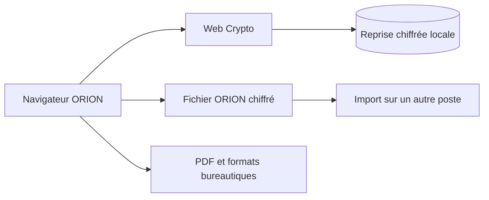

# Architecture du journal

Version 1.0 : application statique React / TypeScript / Vite. Pas de serveur métier. Le serveur facultatif sert uniquement `dist`.

Une session contient un auteur déclaré, un journal actif et les journaux importés pour comparaison. Elle n’est pas un profil réutilisé entre événements. La fin de session efface la reprise locale ; les archives restent sous le contrôle de l’opérateur. Les anciens fichiers `.data/` du projet ne sont pas touchés.

Le modèle conserve des entrées avec identifiant UUID, numéro de registre, auteur/origine et versions successives. Chaque version stocke un instant, un auteur, un motif et l’ensemble des champs métier. Les numéros sont stables ; la chronologie se trie selon l’heure des faits. Une entrée peut être annulée par une correction motivée, sans suppression de son historique.

La fusion conserve l’identifiant global et attribue un numéro dans le journal cible. Elle ignore un doublon exact (hors numéro/origine locale) et refuse les versions divergentes. Une copie séparée reçoit un nouvel identifiant de journal si nécessaire. Les identités importées sont déclaratives, pas des signatures vérifiées.

Le service worker précache seulement les ressources de construction, jamais des données d’intervention. Une mise à jour attend la fermeture des onglets de l’ancienne version. Toutes les dépendances d’export sont locales. La sauvegarde chiffrée utilise IndexedDB avec un verrou exclusif Web Locks pour prévenir les écrasements entre onglets.

L’ancien backend, les comptes, cartes, stocks, graphe de liaisons, outils d’administration et rapports indépendants ont été retirés. Décisions, transmissions, moyens cités et relève vivent uniquement comme informations du journal.
