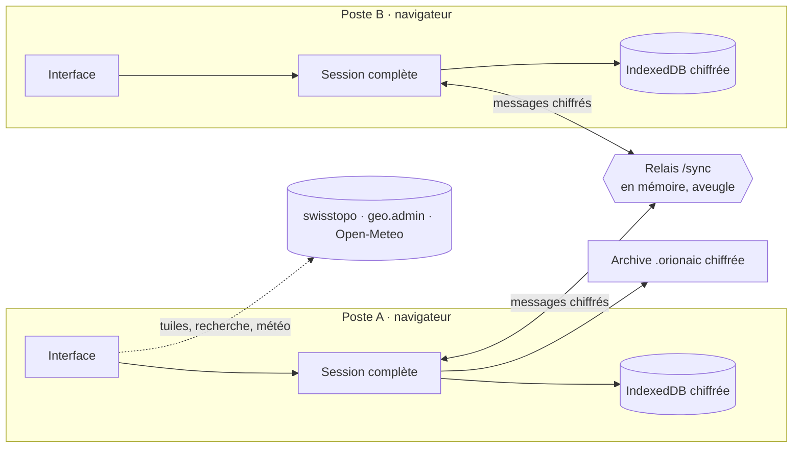

# Architecture d’orion aic

Version 2.0 : application React / TypeScript / Vite, sans base de données. Le serveur sert les fichiers statiques et un relais WebSocket qui ne stocke rien.



## Données

Une **session** (`Workspace`) contient un opérateur déclaré, un ou plusieurs **journaux**, le journal actif, les brouillons et, facultativement, le code de synchronisation. Tout est validé par Zod (`shared/journal.ts`, `shared/ops.ts`).

```
Workspace
├─ version, author, activeId, drafts, room (local), gone (journaux retirés)
└─ journals[]
   ├─ id, title, organization, location, reference, mode, classification, createdAt, closedAt
   ├─ entries[] → revisions[]      journal d’intervention (versions, jamais écrasées)
   ├─ deleted[]                    traces des entrées supprimées
   ├─ radio                        groupes, noms d’appel, terminaux et remises, contrôles
   ├─ ops                          données des modules
   │  ├─ messages                  réception et synthèse
   │  ├─ cells, members            postes / cellules et personnes
   │  ├─ resources                 moyens
   │  ├─ contacts                  annuaire
   │  ├─ places                    objets de la carte (point, ligne, zone, texte, dessin libre)
   │  ├─ maps, symbols             cartes nommées (suivi général, détail…), signes personnalisés
   │  ├─ agenda                    rythme de conduite
   │  ├─ facts, boards             renseignements clés, tableaux de situation
   │  ├─ observations, alerts      météo
   │  ├─ links                     liens explicites entre deux éléments
   │  ├─ snapshots                 points de situation figés (moment nommé)
   │  ├─ exports, presentations    registres : fichiers produits (SHA-256), présentations données
   │  ├─ forecasts                 prévisions météo reçues (une version par réception)
   │  └─ settings                  référentiels, lieu météo, vue de carte
   ├─ sync { clock, removed }      horodatage des changements locaux, suppressions
   └─ history[]                    chaque changement de chaque élément : qui, quand, état après
```

Chaque élément des modules porte un identifiant, sa date de création, de modification et son auteur. Les anciens journaux (1.x) se chargent avec des modules vides.

## Traçabilité et versions

`shared/events.ts` (schéma) et `shared/history.ts` (logique).

- **Enregistrement.** `stampJournal` (appelé par `setWorkspace` pour tout changement local) compare l’ancienne et la nouvelle version, horodate les éléments touchés pour la synchronisation, puis `appendHistory` ajoute un événement par élément : `{ id, at, by, action: create | update | remove, scope, target, state, rev, note }`. `state` est l’élément complet après le changement (`null` s’il est supprimé), `by` l’opérateur du poste. Les entrées du journal ne sont pas dupliquées : leurs versions (`revisions`) et suppressions (`deleted`) jouent ce rôle.
- **Regroupement.** Les retouches d’une même personne sur un même élément en moins de 20 s remplacent l’événement précédent (`rev` + 1) au lieu d’en créer un nouveau.
- **Éléments antérieurs.** Un élément modifié pour la première fois depuis l’existence de l’historique reçoit d’abord un événement « état connu » dont l’identifiant est dérivé de l’élément (`stableId`) : deux postes produisent le même.
- **Fusion.** `mergeHistory` fait l’union par identifiant ; pour un même identifiant, le `rev` le plus haut, puis le plus récent, gagne. Commutative et idempotente, comme le reste de `mergeJournal`.
- **Machine à remonter le temps.** `journalAt(journal, t)` reconstruit un journal valide à l’instant `t` : pour chaque élément, le dernier événement antérieur à `t` ; les éléments sans historique comptent depuis leur `createdAt` ; les entrées gardent leurs versions antérieures à `t` ; les prévisions reçues avant `t`. L’application passe ce journal à tous les modules (`useApp().journal`), en lecture seule ; `useApp().live` reste le journal actuel.
- **Lecture.** `auditTrail` (tout, du plus récent au plus ancien), `trailOf` (un élément), `changesBetween`, `compareVersions` (ajouts, modifications champ par champ, suppressions entre deux versions), `moments` (les pas de la relecture), `restoreState` (remet une version antérieure, comme un nouveau changement signé et annoté).
- **Registres.** Points figés, exports et présentations sont des collections ordinaires (`useApp().record`), écrites même sur un journal clôturé ou depuis la machine à remonter le temps.

Interface : `src/timeline/` (barre du temps et relecture, fiche Historique, ligne « Créé par… » de chaque fiche, points figés), `src/modules/trace/` (module Traçabilité : qui a fait quoi, comparer, points figés, registres).

## Liens

`shared/links.ts` expose chaque élément sous la forme `type:id` (`entry:…`, `message:…`, `place:…`, `resource:…`…), avec un titre, un sous-titre et une tonalité. Les liens combinent :

- les **liens explicites** (`ops.links`) créés par l’opérateur (« Lier ») ou par une action (« Inscrire au journal », « Placer sur la carte ») ;
- les **liens implicites** calculés : références `#012` entre entrées, message inscrit au journal, membre d’un poste, groupes d’un nom d’appel, terminal remis à un nom d’appel, et tout émetteur / destinataire / responsable / détenteur qui correspond au nom d’un poste, d’une personne, d’un moyen, d’un contact ou d’un nom d’appel.

Le graphe (`items`, `edges`) alimente les aperçus au survol, les fiches, la recherche ⌘K et le réseau des liens.

## Synchronisation sans base de données

1. Un poste crée un code de session (16 caractères). Le code n’est jamais envoyé : il sert à dériver l’identifiant de salle (SHA-256) et la clé AES-256-GCM (PBKDF2).
2. Chaque modification locale passe par `setWorkspace`, qui compare l’ancienne et la nouvelle version et horodate les éléments touchés (`stampJournal`). Les journaux modifiés partent 300 ms après la dernière frappe, compressés et chiffrés.
3. À la réception, `mergeJournal` combine les versions de façon déterministe et commutative : versions d’entrées réunies, suppression d’entrée prioritaire, dernière modification gagnante pour les autres éléments, suppression gagnante sur une modification plus ancienne, numéros en double attribués à l’entrée la plus ancienne, plan radio réparé si deux postes ont créé le même nom d’appel. Tous les postes convergent vers le même état.
4. À la connexion puis toutes les 40 s, chaque poste annonce l’empreinte de ses journaux ; un poste dont l’empreinte diffère renvoie ses journaux. Un poste resté hors ligne se remet ainsi à jour.
5. Le relais (`server/relay.mjs`, WebSocket RFC 6455 sans dépendance) ne connaît que des salles en mémoire et transmet des enveloppes opaques.

Le mode réseau local (`server/lan.mjs`) sert la même application et le même relais en HTTPS sur le réseau du poste de conduite, avec un certificat auto-signé.

## Interface

- `src/App.tsx` : coque (dock, barre supérieure, palette ⌘K, dialogues), état de session, synchronisation, impression automatique, routage par ancre (`#journal`, `#map`…).
- `src/app/` : contexte partagé (`useApp`), liste des modules, réglages du poste, dialogue Réglages.
- `src/modules/<module>/` : un dossier par module (situation, journal, messages, missions, carte, moyens, équipe, contacts, météo, agenda, réseau, aide).
- `src/ui/` : kit d’interface (champs standardisés, fiche générique, liens et aperçus, feuille latérale, effets, champ d’étoiles). Guide : [UI.md](UI.md).
- `src/journal/`, `src/radio/`, `src/print/` : journal, réseau radio et impressions A4 / PDF.

Le service worker précache l’application et garde, une fois vus, les signes et jusqu’à 4 000 tuiles de carte. Il ne met jamais de contenu de session en cache.
