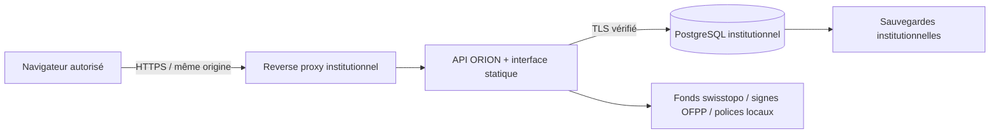

# Architecture ORION 0.2

En mode institutionnel par défaut, l’application ne dispose d’aucun accès réseau sortant métier ; le fond local ne transmet pas les secteurs consultés. Le relais HD optionnel (`MAP_ONLINE=true`, actif dans la démonstration) contacte uniquement le WMTS officiel swisstopo, sans copier les identifiants applicatifs ni les objets opérationnels. Cloudflare peut ajouter des métadonnées réseau ; le relais de démonstration ne garantit pas l’anonymat du visiteur. Les indices des tuiles révèlent cependant le secteur demandé au fournisseur. La préparation explicite des ressources contacte aussi l’OFPP et swisstopo. L’architecture autorise une exploitation sur le réseau privé de l’institution, sans service d’IA.

## Modèle et frontières

`operations` est la frontière métier ; toutes les fiches de `records` lui appartiennent. `memberships` lie les utilisateurs aux dossiers. Les administrateurs sont des acteurs de confiance disposant de tous les dossiers. Les autres comptes passent systématiquement par le contrôle d’affectation sur la route, puis par les contrôles de rôle. Les liaisons sont vérifiées dans le même dossier. Un objet n’est jamais chargé par son identifiant sans vérifier son dossier.

Les objets ont une version entière. Une mise à jour fournit la version lue ; un conflit retourne HTTP 409. Les mutations verrouillent le dossier puis l’objet dans une transaction. La clôture bloque les nouvelles écritures. Imports, contrôles de relations et audit participent à la même transaction : un échec annule l’opération entière.

Les données JSONB sont validées par type et les champs inconnus sont rejetés. Ce choix donne une première version compacte ; les requêtes d’exploitation lourdes devront bénéficier d’index spécifiques ou d’une normalisation des tables suivant les mesures du pilote.

## Rôles

| Rôle            | Consulter les dossiers affectés | Saisir journal/moyens/carte/transmissions | Ordres/validation/rapports | Créer un dossier | Clôturer/rouvrir | Administrer |
| --------------- | ------------------------------- | ----------------------------------------- | -------------------------- | ---------------- | ---------------- | ----------- |
| Lecture         | Oui                             | Non                                       | Non                        | Non              | Non              | Non         |
| Opérateur       | Oui                             | Oui                                       | Non                        | Non              | Non              | Non         |
| Chef de cellule | Oui                             | Oui                                       | Oui                        | Oui              | Non              | Non         |
| Commandement    | Oui                             | Oui                                       | Oui                        | Oui              | Oui              | Non         |
| Administrateur  | Tous                            | Oui                                       | Oui                        | Oui              | Oui              | Oui         |

Le grade ne confère aucun droit automatiquement. Il faut une attribution explicite par un administrateur. Cette matrice doit être validée par l’autorité métier du pilote.

## Authentification

Mot de passe haché par scrypt, sel aléatoire par compte, comparaison constante. Authentification TOTP (RFC 4226/6238, fenêtre ±30 secondes, rejet du rejeu), avec secret chiffré AES-256-GCM. Première connexion limitée au parcours d’enrôlement. Cookie de session opaque HttpOnly/SameSite Strict, Secure en production ; seul le SHA-256 du jeton est enregistré. Rotation après MFA. Expiration absolue de 8 heures et après 30 minutes d’inactivité. Les rafraîchissements automatiques n’entretiennent pas la session ; seuls les gestes de l’utilisateur et les écritures la prolongent.

Un changement de droits ou une suspension révoque les sessions. Verrouillage du compte pendant 15 minutes après 5 échecs, plus limitation du débit HTTP. Protection contre les requêtes intersites par contrôle strict de l’origine et jeton CSRF. Aucun mot de passe de base de données n’est fourni au client.

## Audit

Chaque mutation métier, modification des accès, authentification et export produit une entrée. Les consultations des fiches sont également journalisées. Les nouvelles modifications de fiches incluent les noms des champs et des empreintes avant/après ; les valeurs historiques 0.1 restent inchangées. Une chaîne SHA-256 canonique est sérialisée par verrou transactionnel ; les `UPDATE`, `DELETE` et `TRUNCATE` sont bloqués par déclencheur et les droits du rôle applicatif de production.

Ce mécanisme **n’est pas un stockage WORM**, et ne protège pas contre un administrateur de base malveillant qui pourrait réécrire la chaîne entière. Le pilote doit ancrer périodiquement l’empreinte de tête dans un stockage indépendant et définir une collecte SIEM. La politique de conservation reste à arrêter par l’institution ; aucune durée de 10 ans n’est présumée.

## Limites mesurables de cette version

- Rafraîchissement toutes les 15 secondes, pas de diffusion WebSocket.
- Tous les objets d’un dossier sont chargés en mémoire ; pagination et essais de charge requis avant de grands dossiers.
- Pas de fonctionnement d’écriture hors ligne, de réplication multi-site ou de haute disponibilité déjà validée.
- Pas de connecteur annuaire/SSO ni de réseau radio ; imports locaux JSON uniquement.
- Pas de collecte d’AVS, données médicales, reconnaissance faciale ou surveillance de personnes.
- Fond local borné à la zone livrée ; pas de garantie de fraîcheur ou de précision terrain des placements utilisateurs.

## Gouvernance et démonstration partagée

`operation_governance` conserve le cadre, sa version et la validation humaine. Son écriture prend le même verrou de dossier que les mutations métier et les exports pour sérialiser le retrait de validation. `preview_invitations` ne sert qu’au mode de démonstration partagé : empreinte de jeton, expiration et révocation. Les comptes invités ont une date limite vérifiée à chaque requête. Le lanceur ouvre une base distincte sans lire la configuration institutionnelle et clone uniquement le scénario fictif préparé.
