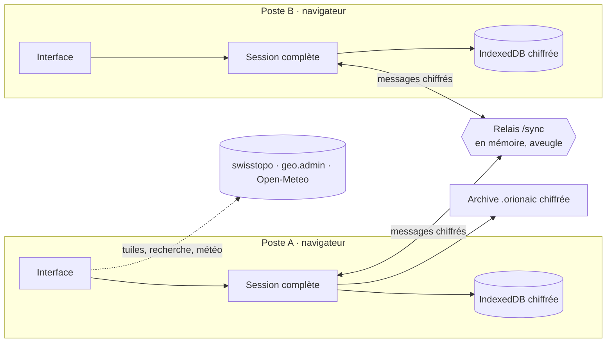

# Architecture d’orion aic

Version 2.0 : application React / TypeScript / Vite, sans base de données. Le serveur sert les fichiers statiques et un relais WebSocket qui ne stocke rien.



## Données

Une **session** (`Workspace`) contient un opérateur déclaré, un ou plusieurs **journaux**, le journal actif, les brouillons et, facultativement, le code de synchronisation. Tout est validé par Zod (`shared/journal.ts`, `shared/ops.ts`).

```
Workspace
├─ version, author, activeId, drafts, room et node (locaux), gone (journaux retirés, horodatés)
└─ journals[]
   ├─ id, title, organization, location, reference, mode, classification, createdAt, closedAt
   ├─ entries[] → revisions[]      journal d’intervention (versions, jamais écrasées ;
   │                               numéro donné à la création, suffixe #007·B si partagé)
   ├─ deleted[]                    traces des entrées supprimées (numéro, création)
   ├─ radio                        groupes, noms d’appel, terminaux et remises, contrôles
   ├─ ops                          données des modules
   │  ├─ messages                  réception et synthèse
   │  ├─ cells, members            postes / cellules et personnes
   │  ├─ resources                 moyens
   │  ├─ contacts                  annuaire
   │  ├─ places                    objets de la carte (point, ligne, zone, texte, dessin libre)
   │  ├─ maps, symbols             cartes nommées (suivi général, détail…), signes personnalisés
   │  ├─ agenda                    rythme de conduite
   │  ├─ facts, boards             renseignements clés, tableaux de situation
   │  ├─ observations, alerts      météo
   │  ├─ links                     liens explicites entre deux éléments
   │  ├─ snapshots                 points de situation figés (moment nommé)
   │  ├─ exports, presentations    registres : fichiers produits (SHA-256), présentations données
   │  ├─ forecasts                 prévisions météo reçues (une version par réception)
   │  └─ settings                  référentiels, lieu météo, vue de carte
   ├─ sync { clock, removed, compacted }
   │                               horodatages (horloge logique hybride) des changements,
   │                               suppressions, filigrane de compaction de l’historique
   ├─ history[]                    chaque changement de chaque élément : qui, quand, état après
   └─ blobs                        images (signes personnalisés), une fois chacune, par SHA-256
```

Chaque élément des modules porte un identifiant, sa date de création, de modification et son auteur. Les anciens journaux (1.x) se chargent avec des modules vides.

**Mise à jour à la lecture.** `journalSchema` passe chaque journal lu (coffre, archive, synchronisation, fusion) par `normalizeJournal` (`shared/journal.ts`), idempotente et identique sur tous les postes : horodatages ISO d’avant 2.1 mis en forme canonique, historique aminci au-delà du filigrane et plafonné à 500 000 événements, images rangées dans `blobs`, numéros donnés aux messages d’avant 2.1 (ceux qu’ils affichaient), suffixes des numéros partagés. Les sessions et archives d’avant 2.1 s’ouvrent donc telles quelles.

## Traçabilité et versions

`shared/events.ts` (schéma) et `shared/history.ts` (logique).

- **Enregistrement.** `stampJournal` (appelé par `setWorkspace` pour tout changement local) compare l’ancienne et la nouvelle version, horodate les éléments touchés pour la synchronisation, puis `appendHistory` ajoute un événement par élément : `{ id, at, by, action: create | update | remove, scope, target, state, rev, note, hlc, base }`. `state` est l’élément complet après le changement (`null` s’il est supprimé), `by` l’opérateur du poste, `hlc` l’horodatage logique, `base` l’horodatage de la version modifiée (deux événements de même `base` sont simultanés). Les entrées du journal ne sont pas dupliquées : leurs versions (`revisions`, avec `hlc`, `base` et `refs`) et suppressions (`deleted`) jouent ce rôle.
- **Images une seule fois.** Un signe personnalisé (jusqu’à 600 Ko) n’est pas recopié dans chaque événement : l’image est rangée dans `journal.blobs` sous son SHA-256 et les états de l’historique la désignent par `blob:<sha256>` (`shared/blobs.ts`). En mémoire, les signes vivants gardent l’image (les modules l’affichent directement) ; enregistrés ou transmis (`packJournal`), ils la désignent aussi par sa référence. Les images plus utilisées sont retirées.
- **Compaction.** Au-delà de 5 000 événements, `appendHistory` avance le filigrane `sync.compacted` (maintenant − 24 h ; − 1 h au-delà de 500 000) : avant lui, chaque élément ne garde que la dernière version de chaque tranche de 15 minutes (2 heures après 7 jours, un jour après 30 jours). Les créations et suppressions sont toujours gardées. Les tranches sont alignées sur des heures fixes et le filigrane se fusionne par maximum : amincir est identique sur tous les postes et la fusion reste commutative, associative et idempotente.
- **Regroupement.** Les retouches d’une même personne sur un même élément en moins de 20 s remplacent l’événement précédent (`rev` + 1) au lieu d’en créer un nouveau.
- **Éléments antérieurs.** Un élément modifié pour la première fois depuis l’existence de l’historique reçoit d’abord un événement « état connu » dont l’identifiant est dérivé de l’élément (`stableId`) : deux postes produisent le même.
- **Fusion.** `mergeHistory` fait l’union par identifiant ; pour un même identifiant, le `rev` le plus haut, puis le plus récent, gagne. Les événements d’un élément sont ordonnés par `hlc` (l’heure pour ceux d’avant 2.1). Commutative, associative et idempotente, comme le reste de `mergeJournal`.
- **Machine à remonter le temps.** `journalAt(journal, t)` reconstruit un journal valide à l’instant `t` : pour chaque élément, le dernier événement antérieur à `t` ; les éléments sans historique comptent depuis leur `createdAt` ; les entrées gardent leurs versions antérieures à `t` ; les prévisions reçues avant `t`. L’application passe ce journal à tous les modules (`useApp().journal`), en lecture seule ; `useApp().live` reste le journal actuel.
- **Lecture.** `auditTrail` (tout, du plus récent au plus ancien), `trailOf` (un élément), `changesBetween`, `compareVersions` (ajouts, modifications champ par champ, suppressions entre deux versions), `moments` (les pas de la relecture), `restoreState` (remet une version antérieure, comme un nouveau changement signé et annoté).
- **Registres.** Points figés, exports et présentations sont des collections ordinaires (`useApp().record`), écrites même sur un journal clôturé ou depuis la machine à remonter le temps.

Interface : `src/timeline/` (barre du temps et relecture, fiche Historique, ligne « Créé par… » de chaque fiche, points figés), `src/modules/trace/` (module Traçabilité : qui a fait quoi, comparer, points figés, registres).

## Liens

`shared/links.ts` expose chaque élément sous la forme `type:id` (`entry:…`, `message:…`, `place:…`, `resource:…`…), avec un titre, un sous-titre et une tonalité. Les liens combinent :

- les **liens explicites** (`ops.links`) créés par l’opérateur (« Lier ») ou par une action (« Inscrire au journal », « Placer sur la carte ») ;
- les **liens implicites** calculés : références `#012` entre entrées, message inscrit au journal, membre d’un poste, groupes d’un nom d’appel, terminal remis à un nom d’appel, et tout émetteur / destinataire / responsable / détenteur qui correspond au nom d’un poste, d’une personne, d’un moyen, d’un contact ou d’un nom d’appel.

Le graphe (`items`, `edges`) alimente les aperçus au survol, les fiches, la recherche ⌘K et le réseau des liens.

## Synchronisation sans base de données

1. Un poste crée un code de session (16 caractères de l’alphabet sans 0, 1, I, L, O). Le code n’est jamais envoyé : PBKDF2-SHA-256 (200 000 itérations) puis HKDF en dérivent deux valeurs indépendantes, l’identifiant de salle et la clé AES-256-GCM (`shared/room.ts`). L’identifiant de salle part dans le premier message WebSocket, jamais dans l’URL.
2. **Horodatage.** Chaque modification locale passe par `setWorkspace`, qui compare l’ancienne et la nouvelle version et horodate les éléments touchés (`stampJournal`) avec une **horloge logique hybride** (`shared/hlc.ts`) : `max(horloge murale, dernier horodatage vu dans ce journal + 1)`, suivi de l’identifiant du poste (`node`, gardé dans la session). Un changement fait après en avoir vu un autre est toujours plus tardif, quelles que soient les horloges ; l’identifiant départage le reste. Les versions d’entrées et les suppressions sont horodatées de la même façon. Les horodatages ISO d’avant 2.1 restent lisibles : ils précèdent tout horodatage hybride de la même milliseconde.
3. **Fusion.** `mergeJournal` combine deux versions de façon déterministe, commutative, associative et idempotente (tests de propriétés sur des postes aléatoires) : versions d’entrées réunies et ordonnées par horodatage (la première et les 499 dernières gardées), suppression d’entrée prioritaire, dernier horodatage gagnant pour les autres éléments, suppression gagnante sur un changement antérieur et perdante face à un changement postérieur, plan radio réparé si deux postes ont créé le même nom d’appel (dans l’ordre des identifiants). Les numéros ne sont jamais changés : voir [JOURNAL.md](JOURNAL.md#numérotation-entre-postes).
4. **Journaux retirés.** `workspace.gone` note l’horodatage du retrait. Un journal n’est retiré que si rien n’y a changé depuis : un journal réimporté ou modifié après son retrait revient sur tous les postes. Une session garde toujours un journal : si tous les journaux d’un poste sont retirés ailleurs, le retrait est noté et appliqué dès qu’un autre journal arrive.
5. **Échanges** (`src/sync/useSync.ts`, décisions dans `shared/protocol.ts`, version de protocole `PROTOCOL` dans chaque message) :
   - `hello` : pour chaque journal, son empreinte (`digest`) et son vecteur de version (dernier horodatage vu de chaque poste). Envoyé à tous à la connexion et toutes les 40 s. Un poste répond, **à l’expéditeur seulement**, par ce qui lui manque et, si quelque chose diffère, par son propre `hello`. Quand tout concorde, une pulsation ne provoque aucune réponse.
   - `state` : des journaux entiers (poste qui ne les a pas) ou seulement ce qui manque (`sliceJournal` contre le vecteur du destinataire : éléments, versions, suppressions, événements plus récents, images utiles), avec les journaux retirés et les empreintes. Si l’empreinte d’un poste n’a pas bougé après une différence (message perdu), il reçoit le journal entier (au plus une fois par minute).
   - Un changement local part 300 ms après la dernière frappe, sous forme de différence avec ce qui a déjà été envoyé. Hors ligne, les changements attendent et partent à la reconnexion.
   - Chaque message est compressé, chiffré et découpé en parts de 192 Ko (trames binaires), réassemblées à l’arrivée : aucun message n’atteint la limite du relais. L’envoi attend que le tampon du navigateur se vide.
   - Reconnexion exponentielle avec gigue (jusqu’à 30 s) ; le délai ne revient au minimum qu’après 30 s de connexion stable.
   - Données d’une version plus récente : champs inconnus ignorés, champs connus validés (`shared/tolerant.ts`). Un poste de version supérieure affiche « Un poste utilise une version plus récente d’orion aic — rechargez la page » au lieu de « en direct ». Un journal refusé est listé avec la raison.
6. **Relais** (`server/relay.mjs`, WebSocket RFC 6455 sans dépendance) : salles en mémoire, trames opaques transmises à un poste (champ destinataire) ou à tous, construites une fois par diffusion. Limites : trame de 1 Mio, 64 postes par salle, 2 000 salles, par adresse 96 connexions, 16 salles et 30 entrées en salle puis une toutes les 2 s ; un poste qui ne lit pas (plus de 8 Mio en attente) est déconnecté plutôt que mis en mémoire. Les pages du protocole 1 (salle dans l’URL) reçoivent 426 et restent en « Reconnexion » jusqu’au rechargement.
7. **Fusions à signaler** (`conflicts()`, `src/sync/ConflictPanel.tsx`, Réglages → Synchronisation) : numéros partagés et leurs suffixes, modifications simultanées (même `base`) avec les deux versions, journaux refusés et pourquoi. Le nombre non vu apparaît dans la puce de synchronisation.

Coût : aucun stockage serveur, mémoire du relais bornée par les limites ci-dessus ; en régime établi, seules des différences et des `hello` circulent.

Le mode réseau local (`server/lan.mjs`) sert la même application et le même relais en HTTPS sur le réseau du poste de conduite, avec un certificat auto-signé.

## Interface

- `src/App.tsx` : coque (dock, barre supérieure, palette ⌘K, dialogues), état de session, synchronisation, impression automatique, routage par ancre (`#journal`, `#map`…).
- `src/app/` : contexte partagé (`useApp`, mémorisé), liste des modules, réglages du poste, dialogue Réglages ; la coque y est découpée : porte d’écriture et actions (`gate.ts`, `useJournalActions.ts`), brouillons (`useDrafts.ts`), pile des superpositions (`overlays.ts`, `OverlayHost.tsx`), barre et menus (`TopBar.tsx`, `ShellMenus.tsx`), palette et raccourcis (`commands.tsx`, `useShortcuts.ts`).
- `src/modules/<module>/` : un dossier par module (situation, journal, messages, missions, carte, moyens, équipe, contacts, météo, agenda, réseau, aide).
- `src/ui/` : kit d’interface (champs standardisés, fiche générique, liens et aperçus, feuille latérale, fond papier). Guide : [UI.md](UI.md).
- `src/journal/`, `src/radio/`, `src/print/` : journal, réseau radio et impressions A4 / PDF.

Le service worker précache l’application (les trois dernières versions restent servies aux onglets encore ouverts) et garde, une fois vus, les signes et les tuiles de carte : une réserve par fond, les moins récemment consultées partant en premier (`src/modules/map/tilecache.ts`, règles partagées avec les tests). Les secteurs hors ligne téléchargés exprès ont leur propre cache, jamais réduit. Il ne met jamais de contenu de session en cache.
